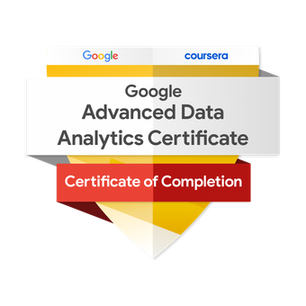

After several years in marketing leadership, I’m currently pursuing a career as a data analyst. 

During my career in marketing, I quickly came to rely on the iterative process of experimentation and always sought to uncover opportunities through out the whole customer journey which led me to learn to combine, manipulate and analyse data from various sources to gain visibility and evaluate the impact of marketing efforts. 

In addition to an already solid skills in data, as I’ve worked in many leadership roles I bring a lot of valuable experience in project management, stakeholder management and understanding of the practicalities of data-driven decision making in a leadership context.

I have been studying full-time during the past year to support this career transition, focusing on core practical skills with Python, SQL and Power BI and theoretical foundations in statistics & probability theory.

## Education

M.Sc. Economics & Business Administration - Hanken School of Economics (_May 2018_)

## Certifications

  
  
  

## Skills

  

    <strong>SQL</strong>
    Proficient
  

  

    

  

  

    <strong>Power BI</strong>
    Proficient
  

  

    

  

  

    <strong>Python</strong>
    Intermediate
  

  

    

  

## Projects

### Marketing Insights for an E-Commerce Company

Worked on data from an e-commerce company with the following list of deliverables:

1. Calculate Invoice amount or sale_amount or revenue for each transaction and item level

2. Detailed exploratory analysis
    * Customers acquired each month
    * Revenue from existing/new customers each month
    * Effect of discounts on revenue
    * Effect of marketing spend on revenue
    * Top products in terms of quantity sold and revenue

3. Customer Segmentation
    * Utilize Heuristic (RFM) and Scientific (K-Means) methods to define customer segments

4. Customer Lifetime Value
    * Define CLV classes for each customer
    * Build classification model

5. Cross-Selling (Which products are selling together)
    * Perform market basket analysis to understand which of items can be bundled together

6. Churn analysis
    * Perform cohort analysis to understand retention on monthly basis
   
[📖 View Notebook](https://nbviewer.org/github/RobinRehn/Portfolio/blob/main/Project%20files/MarketingInsightsForE-Commerce%20Company.ipynb){:target="_blank"}

### SEO analysis in PowerBI

Conducted as an assignment during an hiring process for a data scientist position at a marketing agency.  

<iframe 
  src="https://drive.google.com/file/d/1Up8_nvr92sG3OhCJKYHXj95tWrAoh7vH/preview" 
  width="640" 
  height="480" 
  allow="autoplay">
</iframe>

**Task overview**

Your task is to analyze provided SEO data, clean and prepare it, develop an insightful report in Power BI, and present your findings in a short video presentation.

1. Prepare data
You ‘ve been provided dummy SEO data in three separate CSV files:
* File: page_performance.csv
* File: technical_seo.csv
* File: indexing_content.csv
  
Use these datasets to build a data model that you use for the task. You are allowed to use preferred methods & tools to prepare data. NOTE: Data might include quality issues. This is on purpose.

2. Develop Power BI report

With prepared data model, create MS Power BI report with visualized key findings. Target end-user group for the report is a web & marketing manager with low to medium SEO understanding and analytical maturity. Focus on delivering insights that you find most important, worthwhile and actionable. There is no need to unearth everything from the data.

* The Power BI report should be a single-page dashboard containing 3-7 key visual metrics.
* Focus on report readability and visual storytelling
* No need to publish the report in Power BI service
* Report language: English
* Power BI for report development is mandatory.

3. Deliverable: Video presentation of the task
Record a max 10 min video presentation of your task and findings.
Video presentation should contain two 5 min parts described below.
Presentation language: English

Part 1: Data Preparation & Power BI Report Development (First, max 5 minutes of the Video)
* Present a rundown of the steps you took to clean and structure the data and develop the Power BI report.
* Present a list of work steps to explain how you handled possible data issues, developed the data model, and built the report itself.
* You do not need to show the actual work process, only describe which tools & methods you used and what was found and done.
* You can use preferred tools for presentation. For example: PowerPoint

Part 2: Report & findings presentation to stakeholders (Last, max 5 minutes of video)
* Present the finalized Power BI report with key insights.
* Explain the SEO issues found and recommendations for improvement.
* Use clear and structured storytelling, making the insights actionable and easy to understand
* Focus on delivering insights that you find most important and worthwhile. There is no need to unearth everything from the data. Use time effectively.
* Simulated target group for second part of the video: Web & marketing manager with low to medium level understanding of the subject.

### User Churn Prediction Using Logistic Regression

Developed a logistic regression model to predict user churn for a navigation app. Analyzed user behavior data to identify key factors influencing churn, providing recommendations to enhance user retention.

[📖 View Notebook](https://nbviewer.org/github/RobinRehn/Portfolio/blob/main/Project%20files/Waze_LogisticRegression_cleaned.ipynb){:target="_blank"}

### Taxi Fare Prediction Using Linear Regression

Built a multiple linear regression model to predict taxi fares based on trip attributes. The model aids in fare estimation and helps in understanding fare dynamics.

[📖 View Notebook](https://nbviewer.org/github/RobinRehn/Portfolio/blob/main/Project%20files/Automatidata_LinearRegression_cleaned.ipynb){:target="_blank"}

### Employee Turnover Analysis Using Machine learning

Analyzed employee data to identify factors contributing to turnover at Salifort Motors. Employed decision tree and random forest models to predict employee attrition, offering insights for HR interventions.

[📖 View Notebook](https://nbviewer.org/github/RobinRehn/Portfolio/blob/main/Project%20files/Salifort%20Motors_LogisticRegression_ML.ipynb){:target="_blank"}
